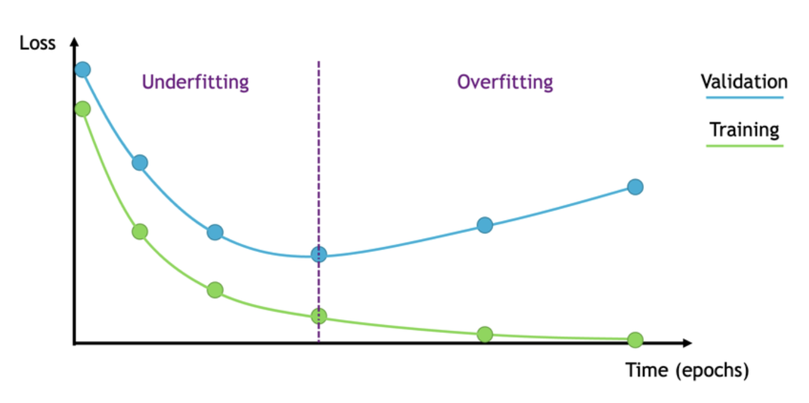

# Overfitting과 Underfitting, 그리고 Early Stopping
###### 주제 : Overfitting과 Underfitting이 일어나는 원인을 분석하고, Early Stopping을 어떻게 활용하여 성능을 개선할 수 있는지 구체적으로 설명하시오

* **Overfitting, 과적합**

  * 모델이 학습 데이터에 지나치게 맞춰진 상태

* **Underfitting, 과소적합**

  * 모델이 데이터의 패턴을 충분히 학습하지 못한 상태

---
## 1. Overfitting, 과적합

### 정의

Overfitting은 모델이 학습 데이터에 지나치게 맞춰져서, 새로운 데이터에 대한 성능이 떨어지는 상태를 의미한다.

즉, 학습 데이터에서는 성능이 매우 좋지만 검증 데이터나 테스트 데이터에서는 성능이 낮아진다.

```text
학습 성능 높음
검증 성능 낮음
→ 학습 데이터에 너무 맞춰진 상태
```

---

### 발생 원인

Overfitting이 발생하는 대표적인 원인은 다음과 같다.

1. 모델이 너무 복잡한 경우
2. 학습 데이터의 수가 부족한 경우
3. 학습을 너무 오래 반복한 경우
4. 데이터에 노이즈가 많은 경우
5. 정규화, Dropout 등의 규제 기법이 부족한 경우

MLP 모델에서 은닉층을 너무 많이 만들거나 뉴런 수를 지나치게 크게 설정하면, 모델이 데이터의 일반적인 패턴이 아니라 학습 데이터의 세부적인 특징이나 노이즈까지 외워버릴 수 있다.

---

## 2. Underfitting, 과소적합

### 정의

Underfitting은 모델이 데이터의 패턴을 충분히 학습하지 못한 상태를 의미한다.

즉, 학습 데이터에서도 성능이 낮고, 테스트 데이터에서도 성능이 낮게 나타난다.

```text
학습 성능 낮음
검증 성능 낮음
→ 모델이 아직 충분히 학습하지 못한 상태
```

---

### 발생 원인

Underfitting이 발생하는 대표적인 원인은 다음과 같다.

1. 모델이 너무 단순한 경우
2. 학습 횟수가 부족한 경우
3. 데이터의 특징을 충분히 반영하지 못한 경우
4. 학습률이 너무 작거나 너무 큰 경우
5. 비선형 데이터에 선형 모델을 사용하는 경우

예를 들어 `make_moons`처럼 반달 모양의 비선형 데이터셋을 단순한 선형 모델로 학습하면, 직선 하나로 데이터를 나누기 어렵기 때문에 과소적합이 발생할 수 있다.

---

## 3. 손실 함수 기준으로 보는 차이

모델 학습 과정에서는 보통 학습 손실과 검증 손실을 함께 확인한다.

### Overfitting

```text
train loss 계속 감소
validation loss 증가
```

모델이 학습 데이터에는 점점 더 잘 맞지만, 새로운 데이터에 대한 성능은 떨어지는 상태이다.

### Underfitting

```text
train loss 높음
validation loss 높음
```

모델이 학습 데이터 자체도 제대로 학습하지 못한 상태이다.

### 적절한 학습 상태

```text
train loss 낮음
validation loss 낮음
```

학습 데이터와 검증 데이터 모두에서 성능이 좋은 상태이다.

---

## 4. 손실 함수 수식

일반적으로 분류 문제에서는 Cross Entropy Loss를 많이 사용한다.

$$
Loss = - \sum_{i=1}^{C} y_i \log(\hat{y_i})
$$

여기서 각 기호의 의미는 다음과 같다.

* $C$ : 클래스 개수
* $y_i$ : 실제 정답
* $\hat{y_i}$ : 모델이 예측한 확률

모델은 이 손실 값을 줄이는 방향으로 학습한다.

하지만 학습 데이터의 손실만 계속 줄이다 보면, 검증 데이터에 대한 성능이 오히려 나빠질 수 있다.
이때 Early Stopping을 사용할 수 있다.

---

## 5. Early Stopping, 조기 중단

### 정의

Early Stopping은 모델을 학습하는 도중, 검증 손실이 더 이상 개선되지 않으면 학습을 멈추는 방법이다.

즉, 모델이 학습 데이터에 과하게 맞춰지기 전에 학습을 중단하여 과적합을 줄이는 방법이다.

---

### 핵심 아이디어

```text
validation loss가 감소하면 → 학습 계속
validation loss가 더 이상 감소하지 않으면 → 학습 중단
```

이때 자주 사용하는 값이 `patience`이다.

```text
patience = 검증 손실이 개선되지 않아도 몇 번까지 기다릴지 정하는 값
```

예를 들어 `patience = 5`라면, 검증 손실이 5번 연속 좋아지지 않을 때 학습을 멈춘다.

---



---

## 6. Early Stopping을 사용하는 이유

Early Stopping을 사용하면 다음과 같은 장점이 있다.

1. 과적합을 줄일 수 있다.
2. 불필요한 학습 시간을 줄일 수 있다.
3. 검증 성능이 가장 좋았던 모델을 사용할 수 있다.
4. 새로운 데이터에 대한 일반화 성능을 높일 수 있다.

즉, Early Stopping은 모델이 학습 데이터를 외우기 전에 적절한 시점에서 학습을 멈추는 역할을 한다.

---

## 7. 최종 정리

| 구분             | 의미                        | 특징                   |
| -------------- | ------------------------- | -------------------- |
| Overfitting    | 학습 데이터에 지나치게 맞춰진 상태       | 학습 성능은 높지만 검증 성능은 낮음 |
| Underfitting   | 모델이 충분히 학습하지 못한 상태        | 학습 성능과 검증 성능 모두 낮음   |
| 적절한 학습         | 일반화가 잘 된 상태               | 학습 성능과 검증 성능 모두 좋음   |
| Early Stopping | 검증 성능이 나빠지기 전에 학습을 멈추는 방법 | 과적합 방지에 도움           |

