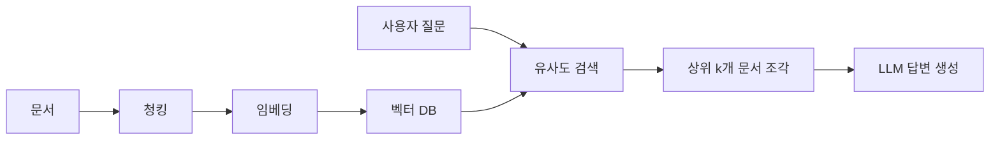
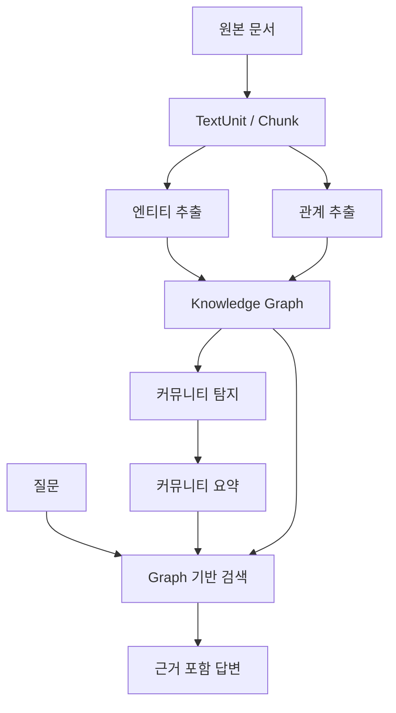
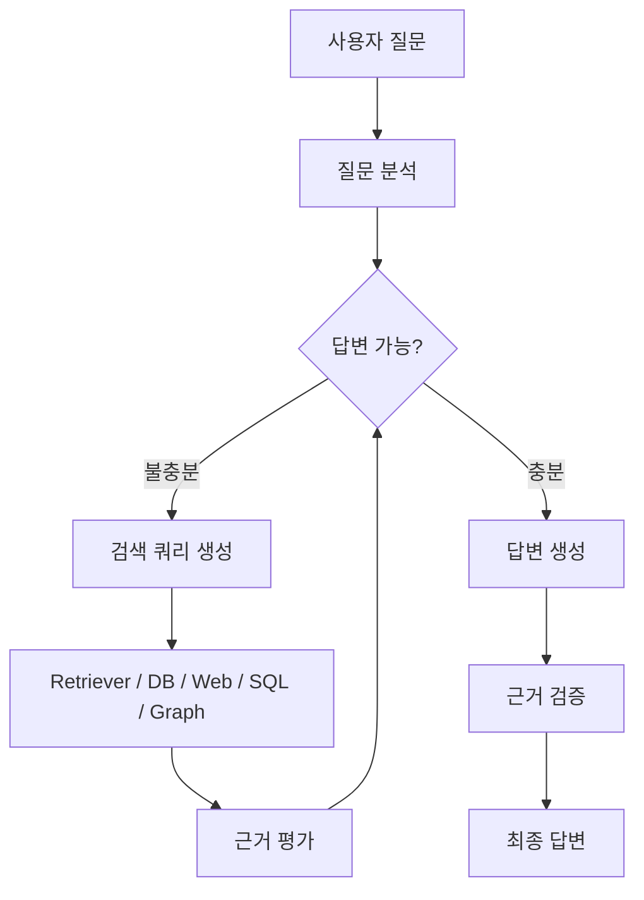
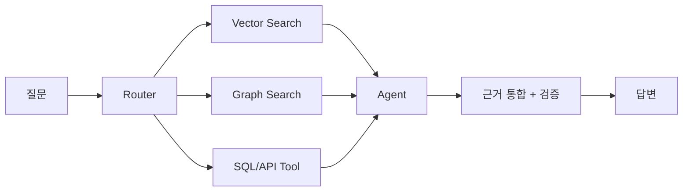
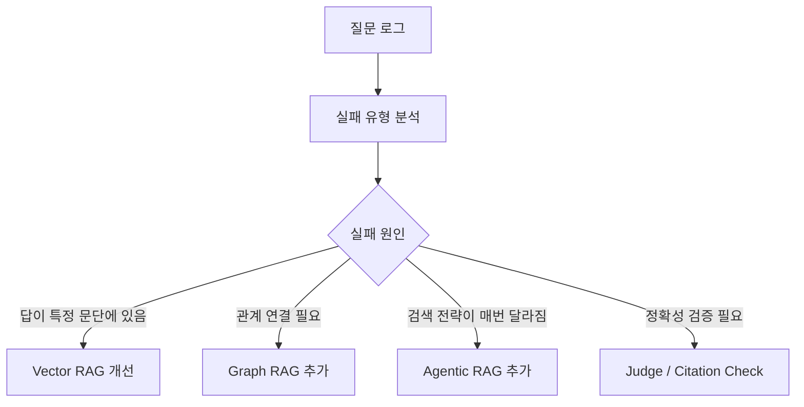

# 벡터 DB 기반 RAG를 보완하는 Graph RAG와 Agentic RAG

> 목표: “벡터 검색만으로 부족한 질문”을 Graph RAG와 Agentic RAG가 어떻게 보완하는지 이해하기

---

## 1. 출발점: 기본 Vector RAG

기본 RAG는 보통 다음 흐름으로 동작한다.



핵심은 “질문과 의미적으로 가까운 문서 조각을 찾는다”는 것이다.

### 장점

- 구현이 쉽고 빠르다.
- 비정형 문서 검색에 강하다.
- FAQ, 정책 문서, 기술 문서 Q&A처럼 “답이 특정 문단에 있는 질문”에 잘 맞는다.

### 한계

- 여러 문서에 흩어진 단서를 연결해야 하는 질문에 약하다.
- “전체 문서 집합의 주요 테마는?” 같은 전역 요약 질문에 약하다.
- 관계, 원인, 영향, 의존성 같은 구조적 정보가 검색 단계에서 사라지기 쉽다.
- 첫 검색 결과가 틀리면 LLM이 그 좁은 컨텍스트 안에서만 답한다.

---

## 2. 왜 보완이 필요한가?

예를 들어 부트캠프 팀 프로젝트에서 프론트엔드, 백엔드, API 명세서, PR 기록, 에러 로그가 따로 관리되고 있다고 하자.

질문:

> “로그인은 성공했다고 뜨는데, 마이페이지에서는 계속 401 에러가 나는 근본 원인은 무엇이고, 어떤 코드 변경과 연결되어 있나?”

Vector RAG는 “로그인”, “401”, “JWT”, “마이페이지”와 가까운 문서 조각을 가져온다.
하지만 실제 답은 다음처럼 흩어져 있을 수 있다.

- 프론트엔드 콘솔: 마이페이지 API 요청에서 401 발생
- 백엔드 로그: JWT 검증 실패
- PR 기록: 로그인 응답 필드명이 accessToken에서 token으로 변경됨
- 팀 회의록/이슈: 인증 응답 구조 변경이 프론트에 공유되지 않음

진짜 원인은 “백엔드 응답 스펙 변경 → 프론트 저장 로직 미수정 → 잘못된 토큰 전달 → 마이페이지 401”이라는 연결을 따라가야 보인다.
즉, 필요한 것은 단순 유사도보다 “관계 연결”과 “반복 탐색”이다.

여기서 두 방향이 나온다.

| 접근 | 보완하는 지점 | 한 줄 요약 |
|---|---|---|
| Graph RAG | 관계와 전역 구조 | 지식 그래프를 만들어 연결해서 찾는다 |
| Agentic RAG | 검색 과정의 유연성 | LLM 에이전트가 검색을 계획하고 반복한다 |

---

## 3. Graph RAG란?

Graph RAG는 문서에서 엔티티와 관계를 추출해 지식 그래프를 만들고, 그 그래프를 검색과 답변 생성에 활용하는 방식이다.

Microsoft GraphRAG 문서에서는 GraphRAG의 과정을 조금더 체계화한다. 

주요 과정은 문서에서 지식 그래프를 추출하고, 커뮤니티 계층을 만들고, 커뮤니티 요약을 생성한 뒤, 질의 시 이 구조를 활용하는 것이다.



### Graph RAG가 잘하는 질문

- “A와 B는 어떤 관계인가?”
- “이 장애와 관련된 시스템, 팀, 변경사항을 모두 연결해줘.”
- “전체 문서에서 반복되는 주요 리스크는 무엇인가?”
- “특정 고객 이슈가 어떤 제품 영역과 연결되는가?”

### 검색 모드 관점

Microsoft GraphRAG는 대표적으로 다음 모드를 제공한다.

| 모드 | 적합한 질문 |
|---|---|
| Global Search | 전체 말뭉치의 큰 주제, 패턴, 트렌드 |
| Local Search | 특정 엔티티 주변의 관계, 근거 탐색 |
| DRIFT Search | 로컬 탐색에 커뮤니티 정보를 더해 맥락 확장 |
| Basic Search | 일반 벡터 검색이 충분한 질문 |

---

## 4. Graph RAG의 장단점

### 장점

- 다중 홉 질문에 강하다.
- 관계 중심의 설명이 가능하다.
- 전체 문서 집합의 요약과 테마 분석에 유리하다.
- 출처를 “문서 조각”뿐 아니라 “엔티티-관계” 단위로 설명할 수 있다.

### 비용과 리스크

- 인덱싱 비용이 커진다. 엔티티/관계 추출에 LLM 호출이 많이 필요할 수 있다.
- 추출 품질이 낮으면 잘못된 그래프가 만들어진다.
- 그래프 스키마를 너무 엄격하게 잡으면 구축이 어렵고, 너무 느슨하면 검색 품질이 떨어진다.
- 실시간성이 필요한 데이터에는 갱신 전략이 필요하다.

---

## 5. Agentic RAG란?

Agentic RAG는 RAG 파이프라인의 일부를 LLM 에이전트에게 맡기는 방식이다.

기본 RAG:

```text
질문 -> 검색 1회 -> 답변
```

Agentic RAG:

```text
질문 -> 계획 -> 검색 -> 판단 -> 추가 검색/도구 사용 -> 검증 -> 답변
```

LangChain의 RAG agent 튜토리얼도 검색 함수를 도구로 만들고, 에이전트가 그 도구를 호출해 답변을 구성하는 형태를 보여준다.



### Agentic RAG가 잘하는 질문

- 질문이 모호해서 먼저 분해해야 하는 경우
- 여러 소스에서 근거를 비교해야 하는 경우
- 검색 결과가 부족하면 다른 쿼리로 재검색해야 하는 경우
- SQL, 벡터 DB, 그래프 DB, API 등을 함께 써야 하는 경우
- 답변 전 검증이나 self-check가 필요한 경우

---

## 6. Agentic RAG의 장단점

### 장점

- 단일 검색 실패에 덜 취약하다.
- 질문 분해, 쿼리 재작성, 근거 평가를 동적으로 수행할 수 있다.
- 도구 조합이 가능하다. 예: Vector DB + Graph DB + SQL + Web Search
- 복잡한 업무형 질문에 적합하다.

### 비용과 리스크

- LLM 호출이 늘어 latency와 비용이 증가한다.
- 에이전트가 잘못된 판단을 반복하면 오류가 누적될 수 있다.
- 도구 권한, 프롬프트 인젝션, 잘못된 도구 실행을 통제해야 한다.
- 운영에서는 tracing, 평가, 최대 반복 횟수, fallback이 필수다.

---

## 7. 세 접근의 비교

| 구분 | Vector RAG | Graph RAG | Agentic RAG |
|---|---|---|---|
| 검색 단위 | 문서 chunk | 엔티티, 관계, 커뮤니티 | 도구 호출 결과 |
| 강점 | 빠르고 단순함 | 관계 추론, 전역 요약 | 반복 탐색, 계획, 검증 |
| 약점 | 연결 추론 약함 | 구축 비용 높음 | 비용/latency/통제 어려움 |
| 적합한 질문 | “문서에 뭐라고 되어 있나?” | “무엇과 무엇이 연결되어 있나?” | “어떻게 찾아야 답할 수 있나?” |
| 운영 포인트 | chunking, embedding, rerank | entity extraction, graph update | tool policy, tracing, loop control |

실무에서는 셋 중 하나만 고르는 것보다 조합하는 경우가 많다.



---

## 8. 간단한 적용 코드 예제

아래 코드는 개념을 보여주기 위한 최소 예제다. 실제 운영에서는 LLM 기반 엔티티 추출, 벡터 DB, 그래프 DB, reranker, tracing을 붙인다.

### 8-1. Graph RAG 느낌의 예제

```python
import networkx as nx

# 1. 문서에서 추출했다고 가정한 엔티티/관계
triples = [
    ("Payment API", "depends_on", "Auth Service"),
    ("Auth Service", "changed_by", "Platform Team"),
    ("Token TTL Policy", "changed_in", "Release 2026-06-12"),
    ("Auth Service", "uses", "Token TTL Policy"),
    ("Payment Incident", "occurred_after", "Release 2026-06-12"),
    ("Payment Incident", "affected", "Checkout"),
]

evidence = {
    ("Payment API", "depends_on", "Auth Service"): "payment_runbook.md#L12",
    ("Auth Service", "changed_by", "Platform Team"): "release_note.md#L8",
    ("Token TTL Policy", "changed_in", "Release 2026-06-12"): "release_note.md#L3",
    ("Auth Service", "uses", "Token TTL Policy"): "auth_design.md#L22",
    ("Payment Incident", "occurred_after", "Release 2026-06-12"): "incident.md#L5",
    ("Payment Incident", "affected", "Checkout"): "incident.md#L9",
}

# 2. 그래프 구축
graph = nx.MultiDiGraph()
for subject, relation, obj in triples:
    graph.add_edge(subject, obj, relation=relation)

# 3. 특정 엔티티 주변 관계 탐색
def local_graph_context(entity: str, depth: int = 2):
    visited = {entity}
    frontier = {entity}
    edges = []

    for _ in range(depth):
        next_frontier = set()
        for node in frontier:
            for _, target, data in graph.out_edges(node, data=True):
                edges.append((node, data["relation"], target))
                next_frontier.add(target)
            for source, _, data in graph.in_edges(node, data=True):
                edges.append((source, data["relation"], node))
                next_frontier.add(source)
        frontier = next_frontier - visited
        visited |= next_frontier

    return edges

question_entity = "Payment Incident"
context = local_graph_context(question_entity)

for edge in context:
    print(edge, "source=", evidence.get(edge))
```

이 예제의 포인트:

- chunk 유사도만 보는 대신 관계 경로를 따라간다.
- “Payment Incident -> Release -> Token Policy -> Auth Service -> Payment API” 같은 연결을 만들 수 있다.
- 최종 답변에는 관계 경로와 원문 출처를 함께 넣는다.

### 8-2. Agentic RAG 느낌의 예제

```python
def vector_search(query: str) -> list[str]:
    # 실제로는 Chroma, FAISS, pgvector, Elasticsearch 등을 호출
    return [f"[vector result] query={query}"]

def graph_search(entity: str) -> list[str]:
    # 실제로는 Neo4j, NetworkX, GraphRAG index 등을 호출
    return [f"[graph result] neighborhood of {entity}"]

def enough_evidence(notes: list[str]) -> bool:
    # 실제로는 LLM judge, rule, citation coverage 등으로 평가
    return len(notes) >= 3

def agentic_rag(question: str) -> str:
    notes = []

    # 1. 초기 검색
    notes += vector_search(question)

    # 2. 질문에서 핵심 엔티티를 뽑았다고 가정
    if "결제" in question or "Payment" in question:
        notes += graph_search("Payment Incident")

    # 3. 근거가 부족하면 쿼리 재작성 후 재검색
    if not enough_evidence(notes):
        notes += vector_search("payment incident auth token release root cause")

    # 4. 답변 생성 단계
    return f"""
    질문: {question}

    사용한 근거:
    {chr(10).join("- " + note for note in notes)}

    답변:
    결제 장애는 단일 문서 조각만으로 판단하기보다,
    결제 API와 인증 서비스의 의존 관계, 토큰 정책 변경,
    배포 시점과 장애 시점을 함께 검토해야 합니다.
    """

print(agentic_rag("최근 결제 장애의 근본 원인은 무엇인가?"))
```

이 예제의 포인트:

- 검색이 한 번으로 끝나지 않는다.
- 벡터 검색과 그래프 검색을 필요에 따라 조합한다.
- 근거가 부족하면 쿼리를 바꿔 다시 찾는다.

---

## 9. 실무 적용 시 추천 아키텍처

처음부터 거대한 Graph RAG/Agentic RAG를 만들기보다 단계적으로 가는 것이 좋다.

1. Vector RAG 기준선을 만든다.
2. 질문 로그를 분석해 실패 유형을 분류한다.
3. 관계 추론 실패가 많으면 Graph RAG를 붙인다.
4. 검색 실패/질문 분해 실패가 많으면 Agentic RAG를 붙인다.
5. 비용과 latency가 커지므로 router로 필요한 경우에만 고급 경로를 탄다.



---

## 10. 발표 결론

Vector RAG는 여전히 기본값이다. 빠르고 단순하며 많은 문제를 해결한다.

하지만 질문이 복잡해질수록 단순 유사도 검색만으로는 부족하다.

- Graph RAG는 문서 속 관계를 구조화해서 “연결해서 생각하는 검색”을 가능하게 한다.
- Agentic RAG는 검색을 고정 파이프라인이 아니라 “계획하고 반복하는 과정”으로 바꾼다.
- 실무에서는 Vector RAG를 버리는 것이 아니라, Graph와 Agent를 필요한 질문에만 붙이는 하이브리드 구성이 현실적이다.