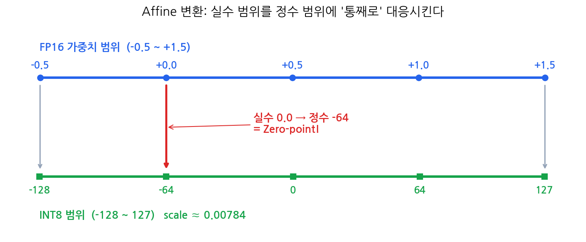
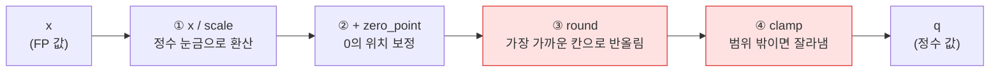
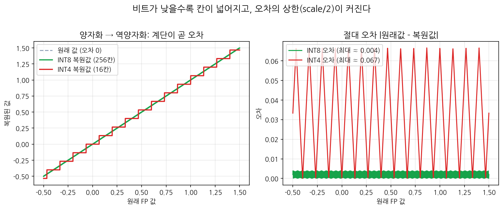
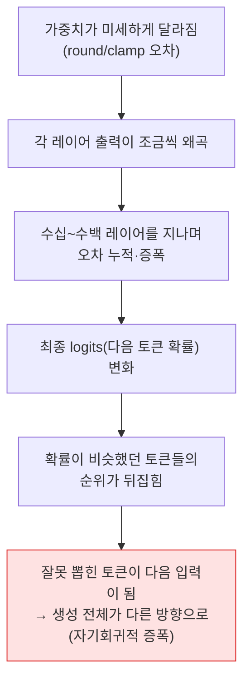
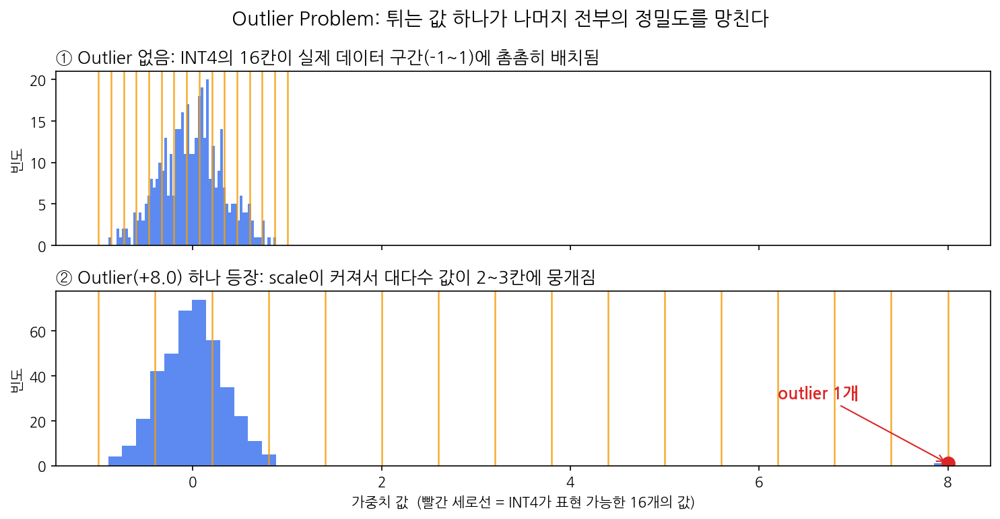

# Zero-point & Scale Factor — 부동소수점은 어떻게 정수가 되는가

> **딥다이브 주제**: LLM Quantization에서 Zero-point와 Scale factor가 부동소수점 가중치를 정수 표현으로 변환하는 과정을 설명하고, 양자화 오차가 모델 출력 품질에 미치는 영향을 서술하시오.

---

## 한 줄 요약

> 양자화는 자료형 변환이 아니라 **범위 매핑**이다.
> Scale은 "눈금 간격"을, Zero-point는 "0의 위치"를 맞추고,
> 그 과정에서 생기는 반올림 오차가 레이어를 타고 누적되어 **다음 토큰 선택을 바꿀 수 있다.**

## 목차

1. [문제 상황: 그냥 int로 바꾸면 안 될까?](#1-문제-상황-그냥-int로-바꾸면-안-될까)
2. [핵심 개념: Scale factor와 Zero-point](#2-핵심-개념-scale-factor와-zero-point)
3. [변환 과정: 공식 4단계 + 손계산](#3-변환-과정-공식-4단계--손계산)
4. [양자화 오차: 어디서, 얼마나 생기나](#4-양자화-오차-어디서-얼마나-생기나)
5. [오차가 모델 출력 품질에 미치는 영향](#5-오차가-모델-출력-품질에-미치는-영향)
6. [실습: 양자화 전후 직접 비교](#6-실습-양자화-전후-직접-비교)
7. [정리: 오차를 줄이는 방향](#7-정리-오차를-줄이는-방향)

---

## 1. 문제 상황: 그냥 int로 바꾸면 안 될까?

LLM의 가중치는 대부분 FP16/FP32 같은 부동소수점입니다. 메모리를 줄이려고 이걸 정수로 바꾸고 싶은데, 파이썬 하듯이 `int(x)`로 캐스팅하면 어떻게 될까요?

```python
int(0.31)  # 0
int(0.72)  # 0
int(-0.4)  # 0
```

가중치 대부분은 0 근처의 작은 실수라서, **거의 전부 0이 되고 모델은 사망**합니다.

그래서 양자화의 진짜 과제는 이겁니다.

 실수 범위 (예: -0.5 ~ +1.5) 를 정수 범위 (예: INT8, -128 ~ 127) 에 **통째로, 빈틈없이 대응**시키기

이 대응은 수학적으로 `y = ax + b` 꼴, 즉 **아핀 변환**입니다. 그래서 이 방식을 **Affine Quantization**이라고 부르고, 여기서 `a` 역할이 **Scale factor**, `b` 역할이 **Zero-point**입니다.

## 2. 핵심 개념: Scale factor와 Zero-point

| 파라미터 | 역할 | 한 줄 직관 |
| --- | --- | --- |
| **Scale factor** | 실수 값의 간격을 정수 한 칸에 대응시키는 비율 | "정수 눈금 **한 칸** = 실수 얼마?" |
| **Zero-point** | 실수 0.0이 정수 범위 어디에 대응될지 정하는 값 | "**0의 위치**를 어디로 옮길까?" |

두 값은 데이터의 최소/최대와 목표 정수 범위로 계산합니다.

```
scale      = (x_max - x_min) / (q_max - q_min)
zero_point = round(q_min - x_min / scale)
```

### 그림으로 보면



포인트는 하나입니다. 데이터 범위(-0.5 ~ +1.5)가 0 중심 대칭이 아니기 때문에, **실수 0.0이 정수 0이 아니라 정수 -64에 대응**됩니다. 이 -64가 바로 Zero-point입니다.

> 💡 **Zero-point가 없으면?** 0을 정수 0에 고정하는 방식이 **대칭(Symmetric) 양자화**입니다. 가중치처럼 0 중심 분포에는 충분하지만, ReLU를 거친 활성화 값처럼 한쪽으로 치우친 분포에서는 정수 칸의 절반 가까이가 낭비됩니다. 그래서 분포에 따라 Affine / Symmetric을 골라 씁니다.

> **0을 왜 특별 취급하지?** 

## 3. 변환 과정: 공식 4단계 + 손계산

양자화 공식은 이 한 줄이 전부입니다.

```
q = clamp( round( x / scale ) + zero_point , q_min , q_max )
```



빨간 두 단계(**round, clamp**)를 기억해 두세요. 뒤에서 오차의 범인으로 다시 소환됩니다.

### 손계산: -0.5 ~ +1.5 를 INT8로

**Step 1. scale 계산** — 실수 범위 2.0을 정수 255칸에 배분

```
scale = (1.5 - (-0.5)) / (127 - (-128)) = 2.0 / 255 ≈ 0.00784
```

**Step 2. zero_point 계산** — 실수 0.0의 정수 위치

```
zero_point = round(-128 - (-0.5) / 0.00784) = round(-128 + 63.75) = -64
```

**Step 3. 변환 확인**

| 원래 값 `x` | 계산 | 정수 `q` |
| --- | --- | --- |
| -0.5 | round(-0.5/0.00784) + (-64) | **-128** |
| 0.0 | round(0/0.00784) + (-64) | **-64** ← Zero-point |
| +1.5 | round(1.5/0.00784) + (-64) | **127** |

범위의 양 끝이 정수 범위 양 끝에 정확히 닿고, 실수 0이 -64로 갑니다. 낭비되는 칸이 없습니다.

### 되돌리기 (역양자화)

```
x_approx = (q - zero_point) * scale
```

양자화의 역순으로, zero_point를 빼서 기준점을 되돌리고 scale을 곱해 실수로 복원합니다. 그런데 **복원값은 원래 값과 완전히 같지 않습니다.** 이 차이가 다음 섹션의 주제, **양자화 오차**입니다.

## 4. 양자화 오차: 어디서, 얼마나 생기나

오차는 공식의 빨간 두 단계에서 나옵니다.

| 발생 지점 | 무슨 일이 일어나나 | 오차의 성격 |
| --- | --- | --- |
| **③ round** | 연속 값을 이산 칸에 반올림해 끼워 넣음 | 모든 값에 최대 **scale/2** 만큼의 오차 |
| **④ clamp (saturation)** | 범위 밖 값이 전부 q_min/q_max로 고정 | 150이든 300이든 다 127 → 큰 값들의 **차이가 소멸** |

### 그림으로 보면



- 왼쪽: 양자화 → 역양자화를 거친 복원값은 **계단 모양**입니다. 계단 위 어디에 있든 가장 가까운 칸으로 끌려가기 때문입니다.
- 오른쪽: INT8(256칸)의 오차는 최대 ≈ 0.004로 미미하지만, **INT4(16칸)는 칸이 넓어져 오차 상한이 ≈ 0.067로 16배** 커집니다.

>  **오차의 상한 공식**: round에 의한 최대 오차 = scale / 2.
> 즉, **scale이 작을수록(=칸이 촘촘할수록) 오차가 작다.** 이 한 줄이 뒤에 나올 모든 이야기의 열쇠입니다.

## 5. 오차가 모델 출력 품질에 미치는 영향

### 5-1. 오차는 어떻게 "답변 품질"까지 도달하나

가중치 하나의 오차는 0.004 수준으로 하찮아 보입니다. 문제는 LLM의 구조입니다.



LLM은 방금 생성한 토큰이 곧 다음 입력이 되는 자기회귀 구조라서, 한 번 어긋난 토큰 선택이 이후 문장 전체를 다른 궤도로 끌고 갈 수 있습니다.

### 5-2. 오차를 키우는 조건 — 특히 Outlier ⭐



| 조건 | 왜 오차가 커지나 |
| --- | --- |
| **Outlier 존재** ⭐ | 튀는 값 하나가 x_max를 키움 → scale이 커짐 → **대다수 정상값이 2~3칸에 뭉개짐** (위 그림 ②) |
| **낮은 비트 수** | INT8 = 256칸 → INT4 = 16칸. 칸이 줄면 scale/2 오차 상한이 커짐 |
| **Per-tensor 단일 scale** | 텐서 전체에 scale 하나 → 내부의 분포 차이를 무시, 큰 값 기준으로 작은 값들이 거칠어짐 |
| **오차에 민감한 레이어** | 모든 레이어가 똑같이 강건하지 않음 → 실무에선 일부 레이어를 FP16으로 유지 |

> ⚠️ **Outlier ≠ 결측치.** Outlier는 "없는 값"이 아니라 "존재하는, 유별나게 큰 값"입니다. 모델 성능에 중요한 정보를 담고 있어 함부로 제거할 수 없고, 그래서 clipping·scaling·분리 처리 같은 완화 기법이 필요합니다. (LLM.int8(), SmoothQuant가 다루는 문제)

### 5-3. 그래서 품질은 실제로 얼마나 떨어지나

| 비트 | 칸 수 | 일반적 경향 |
| --- | --- | --- |
| INT8 | 256 | PTQ만으로도 원본과 거의 구분 어려움 |
| INT4 | 16 | 단순 min-max로는 품질 저하 체감 가능 → GPTQ/AWQ 같은 보정 기법 등장 배경 |
| INT2~3 | 4~8 | 단순 변환으로는 출력이 크게 흔들림 → QAT 검토 영역 |

**실측 결과 (위클리챌린지 챌린지2 — Qwen2.5 기준):**

| 항목 | FP16 | INT8 | INT4 |
| --- | --- | --- | --- |
| 모델 메모리 | ___ GiB | ___ GiB | ___ GiB |
| 추론 속도 (토큰/초) | ___ | ___ | ___ |
| 같은 질문 응답 품질 | 기준 | ___ | ___ |

<!-- 실습 후 숫자 채우기. 교재 참고치: FP16 약 2.88 GiB → INT8 약 1.66 GiB -->

## 6. 실습: 양자화 전후 직접 비교

실무에서는 위 공식을 직접 구현하지 않고, 도구가 로드 시점에 scale/zero-point를 자동 계산합니다.

```python
import torch
from transformers import AutoModelForCausalLM, AutoTokenizer, BitsAndBytesConfig

model_id = "Qwen/Qwen2.5-1.5B-Instruct"

quantization_config = BitsAndBytesConfig(
    load_in_4bit=True,                        # 저장: 4bit
    bnb_4bit_compute_dtype=torch.float16      # 계산: FP16
)

model = AutoModelForCausalLM.from_pretrained(
    model_id,
    quantization_config=quantization_config,
    device_map="auto"
)

print(f"메모리: {model.get_memory_footprint() / 1024**3:.2f} GiB")
```

- 핵심: `load_in_4bit=True`는 "**저장만** 4bit"라는 뜻. 실제 연산은 `compute_dtype`(FP16)으로 수행 → 이런 방식을 **Weight-only Quantization**이라고 함
- 정확히 1/4로 안 줄어드는 이유: 오차에 민감한 일부 레이어는 FP16 유지 (mixed precision)

## 7. 정리: 오차를 줄이는 방향

지금까지의 원인 분석이 그대로 해법 지도가 됩니다.

| 원인 | 대응 기법 |
| --- | --- |
| Outlier가 scale을 오염 | clipping / percentile로 범위 산정, outlier만 FP16 분리 |
| Per-tensor scale의 한계 | **Per-channel / Per-group** scale (INT4에서 특히 중요) |
| 단순 반올림(min-max)의 한계 | **GPTQ**(오차 보정), **AWQ**(중요 가중치 보호) |
| PTQ만으로 정확도 부족 | **QAT** — 학습 중 Fake Quantization으로 오차를 미리 경험시켜 적응 |

### 최종 요약

1. 양자화 = **아핀 변환으로 범위 매핑**. Scale은 눈금 간격, Zero-point는 0의 위치
2. 오차의 근원은 **round(반올림)와 clamp(잘림)**, 오차 상한은 **scale/2**
3. 오차는 레이어를 타고 **누적**되어 토큰 선택을 바꿀 수 있고, **Outlier·저비트·단일 scale**이 오차를 키움
4. 그래서 양자화 기술의 발전사는 곧 **"scale을 작고 정확하게 유지하는 싸움"**이다

---

## 참고

- 수업 교재: Affine Quantization / Weight Quantization / Activation Quantization / QAT (startupcode)
- LLM.int8() — Dettmers et al., 2022 (outlier 분리 처리)
- SmoothQuant — Xiao et al., 2022 (activation outlier 완화)
- 이미지 출처: 본 저장소에서 matplotlib로 직접 생성 (`make_plots.py`)
